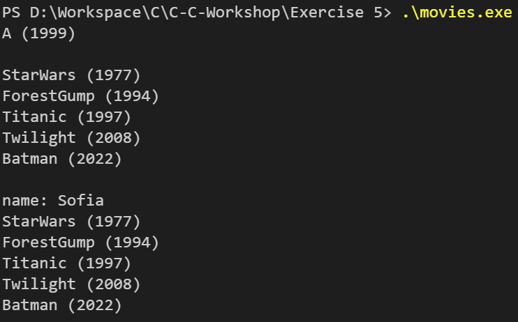

  
  <h1 align="center" style="border-bottom: none"><b>Programming Workshop in C & C++ - Exercise 5 - Movie Recommender</b></h1>

 

  

    <b>Movie Recommender</b> is the 5th exercise I've solved in Huji's <b>Programming Workshop in C & C++</b> course.
     
    The main idea behind this exercise is to get familiar with <b>STL Data Structures</b> and <b>Smart Pointers</b>.
     
  

 

  <h2 align="left" style="border-bottom: 1px solid gray">Usage</h2>

  
Run the project on your personal machine

  <ol align="left">
    <li>Clone this repository using <code>git clone &lt;url&gt;</code></li>
    <li>Open the cloned project in your IDE</li>
    <li>Use a C/CPP compiler such as GCC to compile all relavant files into an executable</li>
    <li>run the created executable file</li>
  </ol>

 

  <h2 align="left" style="border-bottom: 1px solid gray">Media</h2>

  

    
  

 

  <h2 align="left" style="border-bottom: 1px solid gray">Contributing</h2>

  

    Pull requests are welcome. For major changes, please open an issue first to discuss what you would like to change.
  

 
